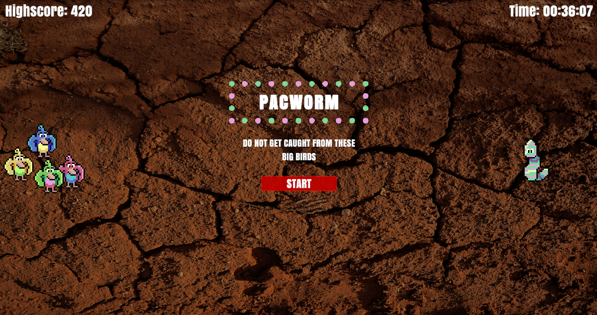
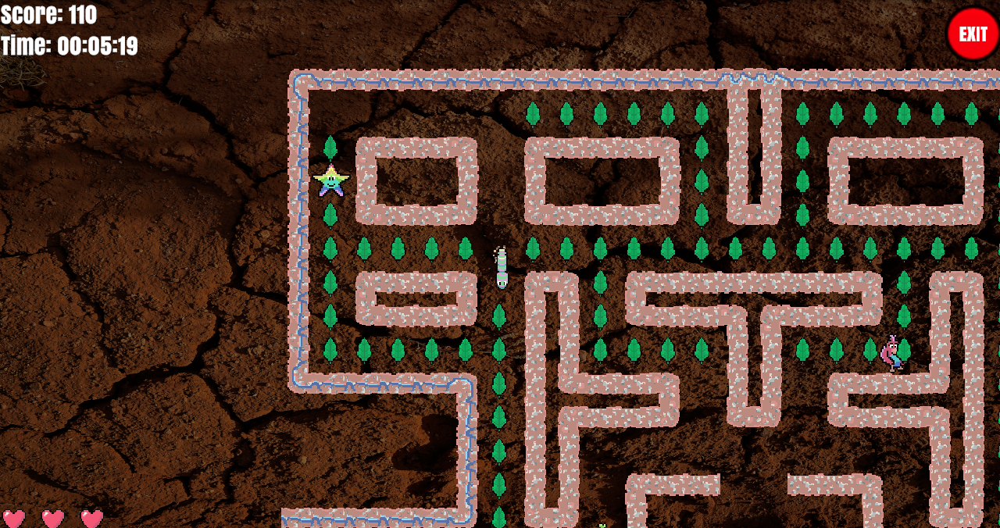
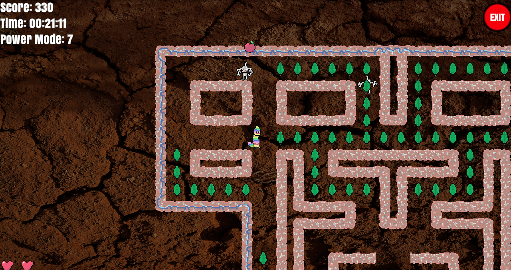

# PACWORM 🪱

PACWORM is a recreation of the famous Atari-era game pac-man, but with own designs and new features.

[Play here 🪱](https://play.unity.com/en/games/63efdd00-1acc-4dc9-a110-08de12107a25/pacworm)

All graphics, animations and sounds are unique and hand crafted. 

Control PACWORM 🪱 with the W A S D keys 🔑 to collect as many delicious leafs as possible while hiding from the 4 birds 🐦.
And maybe you can also catch an even more delicious apple 🍎!

You can take the birds out of the game for a few seconds when in POWER MODE 🚀.

HAVE FUN PLAYING!

### References
Background image from <a href="https://unsplash.com/de/@claybanks?utm_content=creditCopyText&utm_medium=referral&utm_source=unsplash">Clay Banks</a> on <a href="https://unsplash.com/de/fotos/braune-betonziegelmauer-tagsuber-EdscD_R28bM?utm_content=creditCopyText&utm_medium=referral&utm_source=unsplash">Unsplash</a>
      
